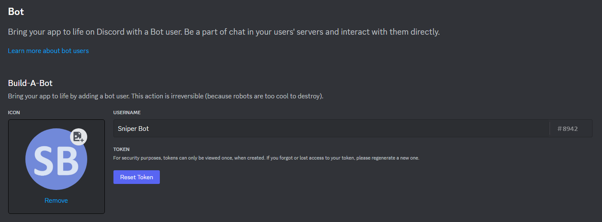

    

Sniper Bot is an automated Python script designed for real-time monitoring of product availability. Powered by web scraping with Selenium, this script allows you to easily track the stock status of your desired items. Stay informed about product availability and take swift action to secure popular items before they sell out. Sniper Bot sends instant notifications through Discord, keeping you updated wherever you are. Leverage the power of Selenium and Discord integration to stay one step ahead in the quest for your favorite products.

## Table of Contents

* [How It Works](#how-it-works)
* [Configuration](#configuration)
    * [Sniper Bot](#sniper-bot)
    * [Discord Bot](#discord-bot)

## How It Works

1. **Web Scraping with Selenium:** Sniper Bot utilizes the Selenium library for web scraping, enabling it to interact with product pages. It simulates a web browser to interact with elements on the page and determine product availability.

2. **Automated Product Monitoring:** Sniper Bot continually monitors the product page you specify. It achieves this by navigating to the provided URL and checking the status of key elements.

3. **Availability Check:** Sniper Bot regularly scans the product page to check for any updates in availability. It searches for specific elements, such as "Add to Cart" buttons, to determine if the product is in stock or out of stock.

4. **Instant Notifications:** When Sniper Bot detects a change in product availability, it promptly sends a notification to your designated Discord channel. This allows you to take immediate action and secure the item before it's gone.

    

        
    

    The image above demonstrates Sniper Bot in action. In the terminal output, you can see the progress updates provided by Sniper Bot as it checks the product availability and adds the item to the cart. Additionally, the Discord integration showcases how the script sends real-time notifications to keep you informed about product availability. 

## Configuration

### Sniper Bot

1. **Product URL:** Open the script and locate the `product_url` variable under the `initialize_sniper` function. Replace the variable with the product page you want to monitor for availability.

2. **Web Driver:** Sniper Bot uses web drivers to automate web interactions. You can choose the web driver that corresponds to your preferred browser:

    - [Chrome Driver](https://sites.google.com/chromium.org/driver/) (For Chrome)
    - [Gecko Driver](https://github.com/mozilla/geckodriver/releases) (For Firefox)
    - Safari Driver (For Safari, built-in)
    - [Edge Driver](https://developer.microsoft.com/en-us/microsoft-edge/tools/webdriver/) (For Microsoft Edge)

    Once you have the web driver ready, open the script and locate the `s` variable under the `initialize_sniper` function. Replace the variable with the file path of the downloaded web driver. 

3. **Locators:** Sniper Bot employs different types of locators to accurately target specific elements on a product page. These locators allow the script to interact with different elements based on their unique attributes. To customize Sniper Bot for your chosen website, you'll need to identify the appropriate locators for the buttons or elements you wish to interact with.

    To do this, open the script and locate the `placeholders` left under the `search` function. Replace each placeholder with the appropriate locator that correspond to the respective element on your product page.

    It is important to mention that Selenium offers alternative locators such as ID, NAME, XPATH, LINK_TEXT, PARTIAL_LINK_TEXT, TAG_NAME, CLASS_NAME and CSS_SELECTOR. This provides you with flexibility when choosing the best locator for your specific needs.

    For comprehensive insights and practical examples, you can refer to the [Selenium with Python documentation](https://selenium-python.readthedocs.io/locating-elements.html).

### Discord Bot

1. **Create a Discord Application:**
    - Go to the [Discord Developer Portal](https://discord.com/developers/applications?new_application=true).
    - Enter a name for your app, then press `Create`.
    - On the General Information page you can update basic information about the app like its description and icon.
    
    

        
    

2. **Discord Application Token:**
    - On the left sidebar, click `Bot`, then click the `Reset Token` button under the Token section. Copy the token as it will not be shown again.
    
    

        
    

    - Open the script and locate the `token` variable under the `send_discord_notification` function. Replace the variable with the with the token you just obtained.

3. **Generate OAuth2 URL for the Bot:**

    - On the left sidebar, click `OAuth2`, then select `URL generator`.
    - Under the OAuth2 URL Generator section, select the `bot` scope and the `Send Messages` permission.
    - Copy the generated URL and paste it into your browser to add Sniper Bot to your Discord server.

4. **Get Channel ID:**

    - Make sure you have `Developer Mode` enabled in your Discord user settings.
    
    

        
    

    
    - Right-click on the desired text channel in your server and click `Copy Channel ID`.
    
    

        
    

    
    - Open the script and locate the `channel_id` variable under the `send_discord_notification` function. Replace the variable with the channel ID you just copied.
